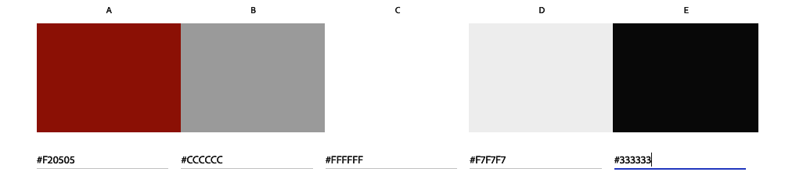
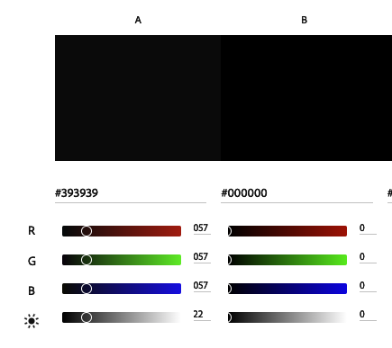

# Wine Time

Find the final project here: [link to final project] 

## Table of Contents
- [Introduction](#introduction)
- [UX](#ux)
- [Ideal User Demographic](#ideal-user-demographic)
- [User Stories](#user-stories)
- [Development Planes](#development-planes)
- [Design](#design)
- [Features](#features)
- [Design Features](#design-features)
- [Existing Features](#existing-features)
- [Features to Implement in the Future](#features-to-implement-in-the-future)
- [Issues and Bugs](#issues-and-bugs)
- [Technologies Used](#technologies-used)
- [Main Languages Used](#main-languages-used)
- [Frameworks, Libraries & Programs Used](#frameworks-libraries--programs-used)
- [Testing](#testing)
- [Deployment](#deployment)
- [Deploying on GitHub Pages](#deploying-on-github-pages)
- [Credits](#credits)
- [Content](#content)
- [Media](#media)
- [Code](#code)
- [Acknowledgements](#acknowledgements)

## Introduction
This is a responsive webpage for Wine Time, a neighborhood wine bar that offers a cozy and relaxed atmosphere for people to discover great food and beautiful wine. The webpage is designed to be viewed on various devices with different screen sizes.

This website was made for the first of four Milestone projects required to complete the Diploma in Software development program at The Code Institute.

The main requirements of this project are to build a responsive and static front-end site to present useful information to users using all the technologies learned so far, namely HTML5, CSS3 and Bootstrap 5.3.0. The site is to contain no less than three pages.

## UX
The website was designed with the following target audience in mind:
- Current users
- New users
- Wine enthusiasts

## Ideal User Demographic
- Over 18
- Londoners, residing in London and visitors
- Wine enthusiasts, pub goers, and non-drinkers

## User Stories
The website was designed to cater to the needs of different users, including:
- Current user goals
- New user goals
- Wine enthusiast goals

### Current User Goals
- See regular updates to information, such as prices and wine selection available
- Easily navigate through the site and access necessary information
- Easily navigate to previously viewed content with minimal steps

### New User Goals
- Easily navigate the site intuitively
- Access easily accessible and relevant information
- Engage with attractive and relevant visuals and colour schemes that work with the content

### Wine Enthusiast Goals
- Easily readable wine lists and prices
- Accessible and relevant information
- See images and/or videos of the business

## Development Planes
To create a comprehensive website that answers the above user stories and identifies the functionality of the site.

### Strategy Plane
This incorporates user needs as well as product objectives. This website focuses on the following target audience divided into three main categories:

Roles:
- Current users
- New users
- Wine enthusiasts

Demographic:
- Over 18
- Londoners, residing in London and visitors
- Wine enthusiasts, pub goers, and non-drinkers

Psychography:
- Lifestyle
- Interest in wines
- Like socializing
- Outgoing, sociable, and multicultural
- Values include being open-minded and having a sense of community

The website needs to enable the user to:
- Retrieve desired information (wine origin, food options, wine list and prices, what the bar looks like, location of business and working hours, and make an online booking enquiry)
- Gather customer details to make reservations

### Scope Plane
This defines the requirements based on the goals established on the strategy plane, categorizing them into content and functionality requirements.

Content Requirements:
- Information on what type of bar it is
- What services are available
- Wines selection and prices
- Where to find the bar
- Pictures of the bar

Functionality Requirements:
- Be able to easily navigate the site to find the information they require
- Be able to contact the site to make a reservation

#### Structure
The information was organized into a hierarchical tree structure or site map to ensure efficient and easy navigation for users.

##### Site Map
(insert image of site map here)

##### Skeleton
Wireframes were created using a desktop version of Balsamiq to showcase the website's appearance and ensure positive user experience.

(insert image of wireframes here)

## Mockups

Please refer to [mockups PDF](https://github.com/irebernardidev/Wine-Time-project1/blob/main/Mockups%20MP1.pdf) for detailed designs.

### Design
The following design elements were used in the website:

- ### Colour Scheme
Using the [Adobe Color](https://color.adobe.com/create/color-wheel) colour wheel, the colour scheme chosen is based on wine red colour.  The dark red primary color is used for the header and some of the buttons, while the beige secondary color is used for section titles and other headings. The text color is a dark gray that provides good contrast against the light background color, and the light orange accent color is used sparingly to add some visual interest.

The website uses a consistent colour palette throughout all pages to ensure visual cohesion.

The overall design of the webpage is simple and elegant, with a focus on showcasing the wine bar's offerings in a visually appealing way. 

### Colour Palette 

- ### Typography

The typography pairing used on the site are [Lobster](https://fonts.google.com/?query=lobster), [Josefin Sans](https://fonts.google.com/?query=josefin) and [Lato](https://fonts.google.com/?query=lato), imported from [Google Fonts](https://fonts.google.com/). A backup of Sans-Serif had been applied in case of import failure.

Lobster was chosen for the headings and titles, Josefin Sans will be used for is used for slogans and paragraphs and Lato for the rest of the body text such as navbar menu, bar details in footer and buttons. The fonts were chosen for their elegant look and excellent legibility, which makes reading and navigation on the website easy and comfortable.

- ### Imagery
High-quality images and/or videos were used to enhance the website's visual appeal and showcase the bar's atmosphere.
The selected imagery has been sourced and created from various sites such as Freepik, Adobe, Canva.

## Features
Each page within the site has a consistent and responsive navigation system. The details of features on the site are detailed below.

The Header is across the top of the page. It is not static as this would cover too much of the screen. 
The navigation bar is only used for screen sizes larger than 1200px. It is then replaced by a hamburger menu.
The Navigation Bar collapses into a Hamburger Menu that, when clicked or tapped, opens a sidebar which shows the navigation options.
The Footer stays at the bottom of the screen at all times, on all screen sizes. Each social media link opens in a new tab.

The website includes the following features:
- Easy navigation system
- Responsive design for all devices
- Information on the type of bar and services available
- Wine selection and prices
- Food menu and prices
- Location of the bar and working hours
- Pictures of the bar
- Online booking enquiry form
- Review Form

### Design Features
Each page on the website has a consistent design and layout, ensuring ease of use and a seamless user experience.

### Existing Features
The website includes the features listed above, all of which have been fully implemented and tested.

### Features to Implement in the Future
Additional features that could be added to the website in the future include:
- Integration with social media platforms
- Live chat support for customer queries
- Online menu ordering

## Issues and Bugs
No issues or bugs have been identified during the testing phase.

## Technologies Used
The following technologies were used in the development of the website:

### Main Languages Used
- HTML5
- CSS3
- JS (only for the map and submission forms)

### Frameworks, Libraries & Programs Used
- Bootstrap 5.3.0
- Balsamiq
- GitHub
- Google Fonts
- Font Awesome 6.3.0

## Testing
The website was tested thoroughly to ensure it is fully functional and user-friendly. The testing phase involved manual testing on different devices and browsers.

## Deployment
The website was deployed on GitHub pages.

### Deploying on GitHub Pages
To deploy the website on GitHub Pages, the following steps were followed:
- Create a new repository on GitHub
- Add the necessary files to the repository
- Go to the settings page of the repository and scroll down to the GitHub Pages section
- Select the main branch and the root folder, then click save
- The website will now be live at the URL provided in the GitHub Pages section

## Credits
The website was built by the developer. The webpages use images from Freepik and Adobe free licence libreries, and icons from Font Awesome.
### Content
All content was written by the website developer.

### Media
All images and/or videos used on the website were obtained from free stock image and video websites.

### Code
The developer consulted multiple sites, including W3Schools, to better understand and implement code. All code copied and edited was referenced in the website's source code.

## Acknowledgements
The developer would like to acknowledge the support and guidance provided by their mentor during the development of this project.
