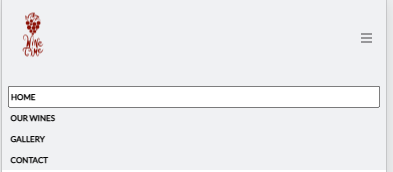
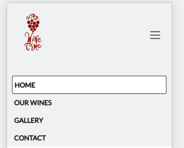
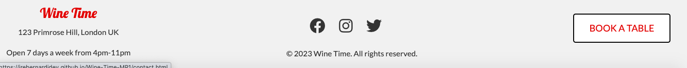
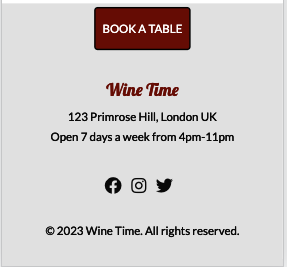
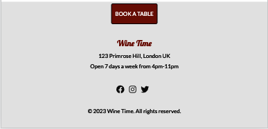

# Wine Time

Find the final project here: [Wine Time MP1](https://irebernardidev.github.io/Wine-Time-MP1/)

## Table of Contents
- [Introduction](#introduction)
- [UX](#ux)
- [Ideal User Demographic](#ideal-user-demographic)
- [User Stories](#user-stories)
- [Development Planes](#development-planes)
- [Design](#design)
- [Features](#features)
- [Design Features](#design-features)
- [Existing Features](#existing-features)
- [Features to Implement in the Future](#features-to-implement-in-the-future)
- [Issues and Bugs](#issues-and-bugs)
- [Technologies Used](#technologies-used)
- [Main Languages Used](#main-languages-used)
- [Frameworks, Libraries & Programs Used](#frameworks-libraries--programs-used)
- [Testing](#testing)
- [Deployment](#deployment)
- [Deploying on GitHub Pages](#deploying-on-github-pages)
- [Credits](#credits)
- [Content](#content)
- [Media](#media)
- [Code](#code)
- [Acknowledgements](#acknowledgements)

## Introduction
This is a responsive webpage for Wine Time, a neighborhood wine bar that offers a cozy and relaxed atmosphere for people to discover great food and beautiful wine. The webpage is designed to be viewed on various devices with different screen sizes.

This website was made for the first of four Milestone projects required to complete the Diploma in Software development program at The Code Institute.

The main requirements of this project are to build a responsive and static front-end site to present useful information to users using all the technologies learned so far, namely HTML5, CSS3 and Bootstrap 5.3.0. The site is to contain no less than three pages.

## UX
The website was designed with the following target audience in mind:
- Current users
- New users
- Wine enthusiasts

## Ideal User Demographic
- Over 18
- Londoners, residing in London and visitors
- Wine enthusiasts, pub goers, and non-drinkers

## User Stories
The website was designed to cater to the needs of different users, including:
- Current user goals
- New user goals
- Wine enthusiast goals

### Current User Goals
- See regular updates to information, such as prices and wine selection available
- Easily navigate through the site and access necessary information
- Easily navigate to previously viewed content with minimal steps

### New User Goals
- Easily navigate the site intuitively
- Access easily accessible and relevant information
- Engage with attractive and relevant visuals and colour schemes that work with the content

### Wine Enthusiast Goals
- Easily readable wine lists and prices
- Accessible and relevant information
- See images and/or videos of the business

## Development Planes
To create a comprehensive website that answers the above user stories and identifies the functionality of the site.

### Strategy Plane
This incorporates user needs as well as product objectives. This website focuses on the following target audience divided into three main categories:

Roles:
- Current users
- New users
- Wine enthusiasts

Demographic:
- Over 18
- Londoners, residing in London and visitors
- Wine enthusiasts, pub goers, and non-drinkers

Psychography:
- Lifestyle
- Interest in wines
- Like socializing
- Outgoing, sociable, and multicultural
- Values include being open-minded and having a sense of community

The website needs to enable the user to:
- Retrieve desired information (wine origin, food options, wine list and prices, what the bar looks like, location of business and working hours, and make an online booking enquiry)
- Gather customer details to make reservations

### Scope Plane
This defines the requirements based on the goals established on the strategy plane, categorizing them into content and functionality requirements.

Content Requirements:
- Information on what type of bar it is
- What services are available
- Wines selection and prices
- Where to find the bar
- Pictures of the bar

Functionality Requirements:
- Be able to easily navigate the site to find the information they require
- Be able to contact the site to make a reservation

#### Structure
The information was organized into a hierarchical tree structure or site map to ensure efficient and easy navigation for users.

##### Site Map
(insert image of site map here)

##### Skeleton
Wireframes were created using a desktop version of Balsamiq to showcase the website's appearance and ensure positive user experience.

Please refer to [mockups PDF](https://github.com/irebernardidev/Wine-Time-project1/blob/main/Mockups%20MP1.pdf) for detailed designs.

### Design
The following design elements were used in the website:

- ### Colour Scheme
Using the [Adobe Color](https://color.adobe.com/create/color-wheel) colour wheel, the colour scheme chosen is based on wine red colour.  The dark red primary color is used for the header and some of the buttons, while the beige secondary color is used for section titles and other headings. The text color is a dark gray that provides good contrast against the light background color, and the light orange accent color is used sparingly to add some visual interest.

The website uses a consistent colour palette throughout all pages to ensure visual cohesion.

The overall design of the webpage is simple and elegant, with a focus on showcasing the wine bar's offerings in a visually appealing way. 

### Colour Palette 

- ### Typography

The typography pairing used on the site are [Lobster](https://fonts.google.com/?query=lobster), [Josefin Sans](https://fonts.google.com/?query=josefin) and [Lato](https://fonts.google.com/?query=lato), imported from [Google Fonts](https://fonts.google.com/). A backup of Sans-Serif had been applied in case of import failure.

Lobster was chosen for the headings and titles, Josefin Sans will be used for is used for slogans and paragraphs and Lato for the rest of the body text such as navbar menu, bar details in footer and buttons. The fonts were chosen for their elegant look and excellent legibility, which makes reading and navigation on the website easy and comfortable.

- ### Imagery
High-quality images and/or videos were used to enhance the website's visual appeal and showcase the bar's atmosphere.
The selected imagery has been sourced and created from various sites such as Freepik, Adobe, Canva.

## Features

---

### Design Features
Each page within the site has a consistent and responsive navigation system. The details of features on the site are detailed below.

The Header is across the top of the page. It is not static as this would cover too much of the screen. 
The navigation bar is only used for screen sizes larger than 1200px. It is then replaced by a hamburger menu.
The Navigation Bar collapses into a Hamburger Menu that, when clicked or tapped, opens a sidebar which shows the navigation options.
The Footer stays at the bottom of the screen at all times, on all screen sizes. Each social media link opens in a new tab.
Each page on the website has a consistent design and layout, ensuring ease of use and a seamless user experience.

The website includes the following features:
- Easy navigation system
- Responsive design for all devices
- Information on the type of bar and services available
- Wine selection and prices
- Food menu and prices
- Location of the bar and working hours
- Pictures of the bar
- Online booking enquiry form
- Review Form

### [General Features](#general-features)
[Navigation bar](#navigation-bar): The navbar is responsive and adapts to different screen sizes. It includes a logo, a button for toggling the navbar menu, and links to the other pages on the website.The active page should appear inside a whiter box with a black border, the the other pages should highlight in red when hovered over, this applies to both desktop and collapsible nav bars.

[Social media links](#socialmedia-links):
The footer section includes links to Wine Time's social media profiles on Facebook, Instagram, and Twitter, as well as a copyright notice. Each social media site should appear dark grey, on hover, it should turn red and when clicked, should open in a new tab.

[Carousel](#carousel): The carousel displays three images that highlight the wine bar's atmosphere, food, and wine selection. The carousel includes indicators/dots for navigating between the images, as well as left and right control buttons/icons.

Wine Bar Section: This section provides a description of the wine bar and its philosophy. It also includes links to the wine menu and appetizer menu. The section is split into two columns, with the left column featuring a large header, a description, and two buttons linking to the menus. The right column features an image of the wine bar.

[Footer](#footer): The footer contains information about the wine bar's location and hours, as well as links to its social media pages. It also includes a call-to-action button for booking a table.

# Existing Features

## Favicon
The favicon is located in the assets/images/ directory and is set as favicon.ico in the head section. Favicons help users quickly identify a website when multiple tabs are open or when searching through bookmarks.

## Header
Appearing on every page for brand recognition.

## Navigation Bar
Appearing on every page for a consistently easy and intuitive navigable system on larger screens.

## Hamburger Menu
Appearing on every for a consistently easy and intuitive navigable system on smaller screens.

## Social Media Icons
Appearing on every page, the icons are appropriate representations of the Social Media platforms, linking users to the various platforms. The icons appear in the centre of the footer.

## Carousel
The website features a carousel (slideshow) with images and captions that showcase different aspects of Wine Time, such as vineyards, wine selections, and the overall atmosphere. This provides an engaging and visually appealing introduction to the wine bar.

## Wine Bar Section
This section highlights the philosophy and offerings of Wine Time, including a brief description, a wine menu, and appetizers. It provides an overview of what visitors can expect when they visit the wine bar.

## Wine Menu and Appetizers Buttons
The Wine Menu and Appetizers buttons in the README.md file are direct links to the PDF files of the respective menus. These buttons provide quick and easy access to the detailed information about the offerings at Wine Time.

* Wine Menu: The Wine Menu button links to a PDF file  that contains a list of the wines available at Wine Time. The menu may include details like wine names, descriptions, regions, and prices, allowing visitors to explore and choose from a curated selection of wines.

* Appetizers: The Appetizers button links to another PDF file  that showcases the food offerings at Wine Time. This menu typically includes a variety of small plates, finger foods, or other light fare that pairs well with wine, enhancing the overall experience for visitors. The menu may include dish names, descriptions, and prices.

## Hero Section
* Full-screen background video that plays automatically, in a loop, and muted.

* Overlaying the video is the hero content with a welcome message and a brief description of the wine bar.

## Wine Description Section
A brief introduction to the different types of wines available at Wine Time: Red Wines, White Wines, and Sparkling Wines.

## Wine List Section
* Displays "Our Wines of the Week" using a Bootstrap grid layout.
* Three flip cards showcasing Red Wines, White Wines, and Sparkling Wines with an image and a description on the front, and a list of featured wines with their prices on the back.

## Video Modals
The website includes three video modals that can be accessed by clicking on the respective images in the Producer Spotlights section. Each modal features a video about a specific wine producer.

## Photo Gallery
The photo gallery displays a collection of images representing the atmosphere and offerings at Wine Time. Images are organized into four columns with captions visible on hover.

## Write a Review Button
A call-to-action button is placed below the photo gallery, prompting users to write a review of their experience at Wine Time.

## Proucer Spotlights
This section showcases three featured wine producers with clickable images that open video modals:

1. Guardastelle Vineyard
2. Montefioralle Winery
3. Chianti Winery

## Google Map and Contact Form
The Google Map and Contact Form feature consists of two main components: the Google Map and the Contact Form. These components are placed side by side within a responsive container, ensuring they display correctly on various screen sizes.

### Google Map
The Google Map is embedded in the left column using the Google Maps API. It displays the exact location of the wine bar, providing users with a visual reference to help them find the establishment. The map can be interacted with, allowing users to zoom in or out, move around the map, and even get directions to the wine bar. The API key for the Google Maps API is included in the script tag in the head section of the HTML file.

### Contact Form
The Contact Form is located in the right column and is designed to allow users to get in touch with the wine bar easily. The form consists of the following input fields:

1. Name (required): A text input field for users to enter their name.
2. Email (required): An email input field for users to enter their email address. This field includes email validation to ensure a valid email address is provided.
3. Message (required): A textarea input field for users to enter their message.

Additionally, there is a submit button with the label "Send message". When the user clicks this button, the form is submitted, and a script (form-handler.js) processes the form submission. It checks for any validation errors and displays them to the user if necessary. If the form submission is successful, the user receives a response message.

This feature allows the Wine Time website to provide an interactive and user-friendly way for visitors to locate the wine bar and get in touch with any questions, comments, or reservations.

## Customer Review Section
The Customer Reviews section displays three reviews from customers who have visited the wine bar. Each review includes the customer's image, name, and a quote. This section helps to showcase positive feedback from satisfied customers.

## Form Submission Success Page
The Form Submission Success Page is designed to provide feedback to users after they have successfully submitted the contact form on the Wine Time website. This page consists of the following elements:

1. Background Image: A full-screen background image (background-image.jpg) is displayed on this page. It serves as a visual backdrop for the content and adds aesthetic appeal.

2. Text Container: A container element holds the text and button. It is positioned over the background image and contains the following elements:

* Heading: A large heading (h1) with the text "Form Submission Successful" informs the user that their form submission was successful.

* Subheading: A subheading (p with class "lead") provides additional information to the user, stating, "Thank you for contacting us. We will get back to you shortly." This message reassures the user that their inquiry has been received and that they can expect a response from the Wine Time team.

* Back to Contact Page Button: A button (with class "btn custom-button") is placed below the subheading. When clicked, it redirects the user back to the contact page. This button provides an easy way for users to return to the contact page if they wish to review their submission or submit another inquiry.

The Form Submission Success Page is designed with user experience in mind, as it provides clear feedback on the form submission's outcome and offers a seamless way to navigate back to the contact page. This page helps build trust and credibility with the user by promptly acknowledging their inquiry and assuring them of a timely response from the Wine Time team.

## Write a Review Page
### Review Form
The review form allows users to submit a review about their experience at Wine Time. The form contains fields for the user's name, email address, and review text. Form validation is performed using custom JavaScript.

### Background Image
The background image features an assortment of wine bottles, adding visual interest and reinforcing the theme of the website.

## Thank You Page
The Thank You page is displayed when a user submits a review. Its purpose is to acknowledge the user's input, express gratitude for their feedback, and provide an option to return to the home page.

# Features to Implement in the future
Additional features that could be added to the website in the future include:
- Integration with social media platforms
- Live chat support for customer queries
- Online menu ordering

[Back to top](#)

## Issues and Bugs
No issues or bugs have been identified during the testing phase.

## Technologies Used
The following technologies were used in the development of the website:

### Main Languages Used
- HTML5
- CSS3
- JS (only for the map and submission forms)

### Frameworks, Libraries & Programs Used
- [Bootstrap 5.3.0](https://getbootstrap.com/)
- [Balsamiq](https://balsamiq.com/) was used to create the wireframes during the design phase of the project.
- [GitHub](https://github.com/) was used to store the project after pushing.
- [Google Fonts](https://fonts.google.com/) was used to import the fonts "Lobster", "Josefin Sans" and "Lato" into the style.css file. These fonts were used throughout the project.
- [Font Awesome 6.3.0](https://fontawesome.com/) was used on almost all pages throughout the website to import icons (e.g. social media icons) for UX purposes.
- [Am I Responsive?](https://ui.dev/amiresponsive) was used in order to see responsive design throughout the process and to generate mockup imagery to be used.

## Testing
The website was tested thoroughly to ensure it is fully functional and user-friendly. The testing phase involved manual testing on different devices and browsers.

## Deployment
The website was deployed on GitHub pages.

### Deploying on GitHub Pages
To deploy the website on GitHub Pages, the following steps were followed:
- Create a new repository on GitHub
- Add the necessary files to the repository
- Go to the settings page of the repository and scroll down to the GitHub Pages section
- Select the main branch and the root folder, then click save
- The website will now be live at the URL provided in the GitHub Pages section

## Credits
The website was built by the developer. The webpages use images from Freepik and Adobe free licence libreries, and icons from Font Awesome.
### Content
All content was written by the website developer.

### Media
All images and/or videos used on the website were obtained from free stock image and video websites.

### Code
The developer consulted multiple sites, including W3Schools, to better understand and implement code. All code copied and edited was referenced in the website's source code.

## Acknowledgements
The developer would like to acknowledge the support and guidance provided by their mentor during the development of this project.
