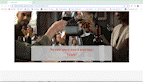

# Wine Time - Testing
[Main README.md file](https://github.com/irebernardidev/Wine-Time-MP1/blob/main/README.md)

[View live project](https://irebernardidev.github.io/Wine-Time-MP1/)

[View GitHub repository](#)

## Table of contents
1. [Testing User Stories](#testing-user-stories)
2. [Manual Testing](#manual-testing)
3. [Automated Testing](#automated-testing)
   * [Code Validation](#code-validation)
   * [Browser Validation](#browser-validation)
4.  [User Testing](#user-testing)

## Testing User Stories
### Current User Goals:
1. **As a current user, I want to see regular updates to information, such as prices and wine selection available.**
- The Wine Bar Section highlights the philosophy and offerings of Wine Time, including a brief description, a wine menu, and appetizers. It provides an overview of what visitors can expect when they visit the wine bar.

- Wine Menu and Appetizers Buttons are direct links to the PDF files of the respective menus. These buttons provide quick and easy access to the detailed information about the offerings at Wine Time.

- The Menu page has three flip cards showcasing Red Wines, White Wines, and Sparkling Wines with an image and a description on the front, and a list of featured wines with their prices on the back.

2. **As a current user, I want to easily navigate through the site and access the information I require with ease.**
- The navigation bar is clearly defined and easily navigable for users to find and use.
- The hamburger menu is also clearly defined and easily navigable for users to find and use.
- The footer menu is easy to use with appropriate icons for easy identification.

3. **As a current user, I want to easily navigate to content I have previously viewed within a small number of steps.**
- On all site pages there is a navigation bar, or hamburger menu, with links to each required page.
- Each information page has links that bring the user to each section of the page.

### New User Goals:
1. **As a new user, I want to easily navigate the entire site intuitively.**
- The navigation bar is clearly defined and easily navigable for users to find and use.
- The hamburger menu is also clearly defined and easily navigable for users to find and use.
- The footer menu is easy to use with appropriate icons for easy identification.

2. **As a new user, I want the information I seek to be easily accessible and relevant.**
- The navigation bar is clearly defined and easily navigable for users to find and use.
- The hamburger menu is also clearly defined and easily navigable for users to find and use.
- The footer menu is easy to use with appropriate icons for easy identification.

3. **As a new user, I want attractive and relevant visuals and colour schemes that work with the content.**
- An attractive colour palette was created using [Adobe Color Wheel](https://color.adobe.com/create/color-wheel)
- Relevant images were found using Unsplash and Pixabay.

[Back to top](#)

## Manual Testing
### Common Elements Testing
Manual testing was conducted on the following elements that appear on every page:

- Hovering over the Hamburger Menu will trigger hover effect, highlighting the icon for the user.

- Clicking on the Social Media links will open a new tab

- The responsiveness of the Home page

- Clicking on the Book a Table button will take the User to the Contact Page

# Home Page

Manual testing was conducted on the following elements of the [Home Page](index.html):

- Carousel slideshow

- Clicking on the Menu and/or Appetizers buttons will open a new tab

# Logo

- Clicking on the Logo image will take the User to the Home Page

# Our Wines

Manual testing was conducted on the following elements of the [Menu Page](menu.html):

- Background video responsiveness

- Flipping Wine Cards

# Gallery Page

Manual testing was conducted on the following elements of the [Gallery Page](gallery.html):

- Gallery page responsiveness

- Producer Spotlights Circle Images Animation and Video Modal:

- Photo Gallery grid (Bootstrap) responsiveness and overlay

- Write a Review button

# Contact Page

Manual testing was conducted on the following elements of the [Contact Page](contact.html):

- Contact page responsiveness

- Contact Form and Send Message button, when filling out the contact form, the user must complete all fields before submitting. Hovering over the submit button will trigger hover effect, highlighting the button for the user.

- Customers Reviews

# Write a Review Page

Manual testing was conducted on the following elements of the [Write a Review Page](write-review.html):

- Write a Review page responsiveness

- Write a Review and Submit button, when filling out the contact form, the user must complete all fields before submitting. Hovering over the submit button will trigger hover effect, highlighting the button for the user.

- Clicking on the Return to Home button will take the User to the Home Page

